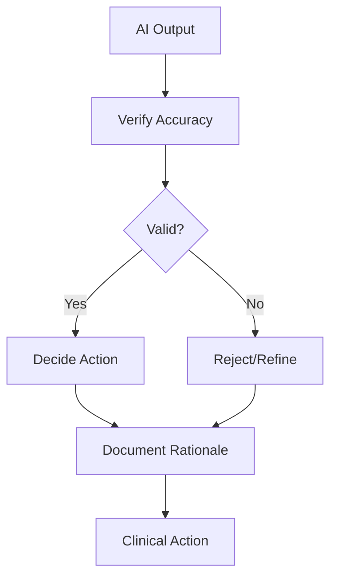

## Overview

Anesthesia SmartSite provides evidence-based frameworks to integrate AI safely into anesthesiology practice. You focus on the VDD Framework—Verify, Decide, Document—to ensure ethical AI use. These concepts promote patient safety and clinical excellence by combining AI insights with your expertise.

<Callout kind="info">
  Always prioritize patient safety. AI supports decisions but never replaces your clinical judgment.
</Callout>

## VDD Framework: Verify, Decide, Document

The VDD Framework guides supervised AI deployment in perioperative care. You verify AI outputs, decide on actions, and document the process for accountability.



### Applying VDD in Practice

<Steps>
  <Step title="Verify" icon="check-circle">
    Cross-check AI recommendations against evidence-based protocols and patient data.
    
````bash
# Example: Verify AI dosage suggestion
patient_weight=75  # kg
ai_dose=2.5        # mg/kg from AI
verified_dose=2.0  # Adjusted per guidelines
````
  </Step>
  <Step title="Decide" icon="brain">
    Weigh AI input with your experience. Choose the safest option.
  </Step>
  <Step title="Document" icon="file-text">
    Record AI use, verification steps, and rationale in the patient's chart.
  </Step>
</Steps>

## AI Governance Principles

Establish clear governance to integrate AI responsibly.

<Columns cols={2}>
  <Card title="Ethical Oversight" icon="shield" href="#">
    Implement review boards for AI tool approvals.
  </Card>
  <Card title="Transparency" icon="eye" href="#">
    Disclose AI assistance in all clinical notes.
  </Card>
  <Card title="Continuous Audit" icon="trending-up" href="#">
    Monitor AI performance with regular outcome reviews.
  </Card>
  <Card title="Training" icon="book-open" href="#">
    Train staff on VDD and AI limitations.
  </Card>
</Columns>

## Supervision and Verification Methods

Choose methods based on your workflow.

<Tabs>
  <Tab title="Real-Time Review" icon="clock">
    Review AI outputs immediately before action.
    
    <Callout kind="tip">
      Use for high-risk decisions like induction dosing.
    </Callout>
  </Tab>
  <Tab title="Batch Verification" icon="layers">
    Validate multiple AI suggestions post-procedure.
    
````javascript
// Pseudocode for batch verification
const aiSuggestions = [
  { patient: 'ID001', dose: 150, verified: false },
  { patient: 'ID002', dose: 200, verified: true }
];

aiSuggestions.forEach(suggestion => {
  if (verifyDose(suggestion.dose, getPatientData(suggestion.patient))) {
    suggestion.verified = true;
  }
});
````
  </Tab>
  <Tab title="Peer Audit" icon="users">
    Conduct team reviews of AI-influenced cases weekly.
  </Tab>
</Tabs>

## Clinical Decision-Making with AI

<Expandable title="Advanced Integration Strategies" default-open="false">
  Integrate AI into decision trees while maintaining human oversight.
  
  | Scenario | AI Role | Your Role |
  |----------|---------|-----------|
  | Pre-op Risk Assessment | Predict complications | Verify with labs/history |
  | Intra-op Monitoring | Flag anomalies | Decide interventions |
  | Post-op Recovery | Suggest protocols | Document adjustments |
  
  Use Anesthesia SmartSite tools to log VDD steps automatically.
</Expandable>

<Expandable title="Common Pitfalls" default-open="true">
  Avoid over-reliance on AI. Always document deviations from suggestions.
</Expandable>

## Next Steps

<Columns cols={2}>
  <Card title="Clinical Protocols" icon="file" href="/protocols">
    Apply VDD to neuroanesthesia protocols.
  </Card>
  <Card title="Knowledge Quiz" icon="help-circle" href="/quiz">
    Test your AI governance knowledge.
  </Card>
</Columns>

<Callout kind="success">
  Implement VDD today for safer AI-assisted care.
</Callout>