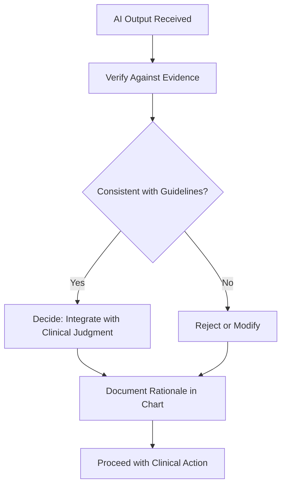

## Overview

The VDD Framework — **Verify, Decide, Document** — is the core methodology for supervised AI use in perioperative care. It ensures that every AI-assisted clinical decision is cross-checked against evidence, weighed with clinical judgment, and recorded for accountability and quality assurance.

<Callout kind="info">
  AI supports clinical decisions but never replaces your judgment. The VDD framework structures how you interact with AI outputs to maintain patient safety.
</Callout>

## The VDD Process

## Applying VDD in Practice

<Steps>
  <Step title="Verify" icon="check-circle">
    Cross-check AI recommendations against evidence-based protocols and patient-specific data.

    **What to verify:**
    - Is the AI recommendation consistent with published guidelines (e.g., ASA, SNACC)?
    - Does it account for patient-specific factors (comorbidities, allergies, medications)?
    - Is the recommended dosage within established ranges for the patient's weight and condition?

    **Clinical scenario:** An AI tool suggests a dexmedetomidine loading dose of 1 mcg/kg over 10 minutes for a 70 kg patient undergoing awake spine surgery. You verify this against your institutional MAC protocol and the patient's cardiac history, noting the patient has a resting heart rate of 52 bpm. The guideline dose is appropriate, but the patient's baseline bradycardia warrants a reduced loading dose or extended infusion time.
  </Step>
  <Step title="Decide" icon="brain">
    Weigh the AI recommendation alongside your clinical experience, patient context, and available evidence. Choose the safest course of action.

    **Decision factors:**
    - Your direct clinical assessment of the patient
    - Institutional protocols and formulary constraints
    - Risk-benefit analysis for this specific clinical scenario
    - Availability of alternative approaches

    **Continuing the scenario:** Based on the patient's bradycardia, you decide to reduce the loading dose to 0.5 mcg/kg over 10 minutes and prepare glycopyrrolate 0.2 mg at the bedside. This decision integrates the AI suggestion with your clinical assessment.
  </Step>
  <Step title="Document" icon="file-text">
    Record AI use, your verification steps, and the rationale for your final decision in the patient's chart.

    **Documentation should include:**
    - That an AI tool was consulted and what it recommended
    - How you verified the recommendation (protocols referenced, patient factors considered)
    - Your clinical decision and the rationale, especially if it differed from the AI suggestion
    - The outcome of the intervention

    **Completing the scenario:** You document in the anesthetic record that an AI-assisted dosage recommendation was received, verified against the MAC protocol, and modified due to the patient's baseline bradycardia. The adjusted dose and prophylactic glycopyrrolate preparation are recorded with rationale.
  </Step>
</Steps>

## When to Apply VDD

The VDD framework applies whenever an AI tool provides a recommendation that influences a clinical decision. This includes:

| Scenario | AI Role | Your VDD Focus |
|----------|---------|----------------|
| Pre-operative risk assessment | Predict complication probability | Verify against labs, imaging, and clinical history |
| Intra-operative drug dosing | Suggest dosage adjustments | Verify against formulary and patient parameters |
| Monitoring alerts | Flag hemodynamic anomalies | Decide if intervention is warranted |
| Post-operative protocols | Suggest recovery pathways | Verify against institutional discharge criteria |

## Common Verification Methods

<Tabs>
  <Tab title="Real-Time Verification" icon="clock">
    Review AI outputs immediately before acting. Use this approach for high-stakes decisions where timing permits.

    **Best for:**
    - Induction dosing recommendations
    - Hemodynamic management suggestions
    - Airway management guidance

    <Callout kind="tip">
      For high-risk decisions like induction dosing, always complete verification before acting, even if it adds time to the workflow.
    </Callout>
  </Tab>
  <Tab title="Batch Review" icon="layers">
    Review multiple AI recommendations together, typically post-procedure or at shift transitions. Appropriate for lower-stakes, non-urgent recommendations.

    **Best for:**
    - Post-operative care pathway suggestions
    - Documentation completeness checks
    - Quality metric analysis
  </Tab>
  <Tab title="Peer Audit" icon="users">
    Conduct regular team reviews of AI-influenced cases. Schedule weekly or monthly reviews to identify patterns, catch errors, and refine institutional AI policies.

    **Best for:**
    - Ongoing quality assurance
    - Training new team members on VDD
    - Identifying systematic AI biases or limitations
  </Tab>
</Tabs>

## Avoiding Common Pitfalls

<Expandable title="Over-Reliance on AI" default-open="true">
  AI outputs can appear authoritative. Guard against automation bias — the tendency to trust AI recommendations without adequate verification, especially under time pressure. Always complete the Verify step before proceeding to Decide.
</Expandable>

<Expandable title="Incomplete Documentation" default-open="false">
  Documenting only the final decision without recording that AI was consulted or how verification was performed limits the value of the VDD process. Complete documentation enables retrospective analysis and quality improvement.
</Expandable>

<Expandable title="Skipping VDD for Routine Tasks" default-open="false">
  AI recommendations for routine tasks still require verification. Errors in routine scenarios can be harder to catch precisely because they are unexpected. Apply VDD consistently regardless of perceived risk level.
</Expandable>

## Next Steps

<Columns cols={2}>
  <Card title="AI Governance" icon="scale" href="/ai/governance" horizontal>
    Establish institutional oversight frameworks for AI tool deployment.
  </Card>
  <Card title="Knowledge Quizzes" icon="help-circle" href="/ai/quizzes" horizontal>
    Test your VDD knowledge with interactive assessments.
  </Card>
</Columns>
